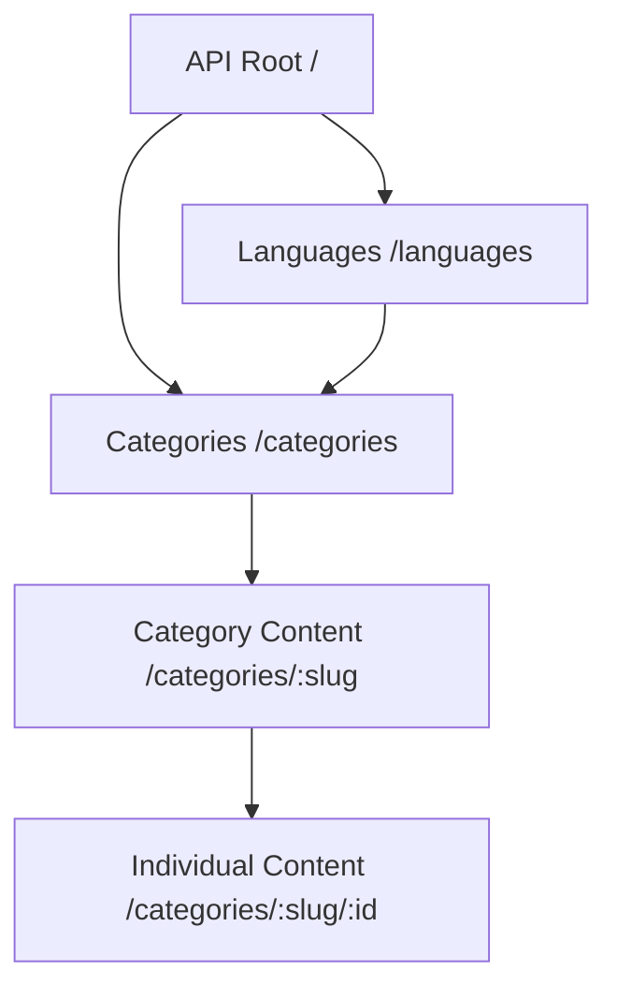

# Dua & Dhikr RESTful API - Product Requirements Document

## 1. Product Overview

Dua & Dhikr RESTful API is an authentic Islamic prayer and remembrance service that provides access to traditional Islamic supplications (dua) and remembrances (dhikr) in multiple languages. The API serves as a comprehensive digital resource for Muslims seeking authentic Islamic content with proper Arabic text, transliterations, translations, and scholarly references.

The API addresses the need for reliable, authenticated Islamic content accessible through modern web technologies, serving developers, Islamic applications, and educational platforms worldwide.

## 2. Core Features

### 2.1 User Roles

This API follows a public access model without user authentication requirements:

| Role | Access Method | Core Permissions |
|------|---------------|------------------|
| Public User | Direct API access | Can access all endpoints with rate limiting (2 requests/second) |
| Developer | API integration | Can integrate API into applications with standard HTTP requests |

### 2.2 Feature Module

Our API consists of the following main endpoints:

1. **Home Endpoint**: API information and documentation redirect
2. **Languages Endpoint**: Available language options for content
3. **Categories Endpoint**: List of dua and dhikr categories
4. **Category Content Endpoint**: List of items within specific categories
5. **Individual Content Endpoint**: Detailed dua/dhikr content with full text and metadata

### 2.3 Page Details

| Endpoint | Module Name | Feature Description |
|----------|-------------|--------------------|
| GET / | Home | Redirects to GitHub documentation repository |
| GET /languages | Language Service | Returns available languages (Indonesian, English) with language codes |
| GET /categories | Category Listing | Returns categorized list of dua/dhikr types based on Accept-Language header |
| GET /categories/:slug | Content Listing | Returns list of items within specified category with titles and IDs |
| GET /categories/:slug/:id | Content Detail | Returns complete dua/dhikr content including Arabic text, transliteration, translation, notes, benefits, and source |

## 3. Core Process

### 3.1 Content Access Flow

Users access Islamic content through a hierarchical structure:
1. Discover available languages through `/languages` endpoint
2. Browse categories of dua/dhikr through `/categories` endpoint
3. List specific content within categories using `/categories/:slug`
4. Access detailed content including Arabic text, transliteration, and translation via `/categories/:slug/:id`

### 3.2 API Navigation Flow

## 4. User Interface Design

### 4.1 Design Style

As a RESTful API, the interface design focuses on:
- **Response Format**: Consistent JSON structure with statusCode, code, message, and data fields
- **Content Structure**: Hierarchical organization from categories to individual items
- **Language Support**: Content-negotiation based on Accept-Language headers
- **Error Handling**: Standardized error responses with appropriate HTTP status codes
- **Performance**: Caching implementation and compression for optimal response times

### 4.2 API Response Design

| Endpoint | Response Structure | Key Elements |
|----------|-------------------|-------------|
| /languages | Standard API response | Array of language objects with label and code |
| /categories | Standard API response | Array of categories with name, slug, and total count |
| /categories/:slug | Standard API response | Array of content items with id, title, category info |
| /categories/:slug/:id | Standard API response | Complete content object with Arabic, Latin, translation, notes, benefits, source |

### 4.3 Content Categories

The API serves five main categories of Islamic content:
- **Morning Dhikr** (morning-dhikr): Remembrances for morning recitation
- **Evening Dhikr** (evening-dhikr): Remembrances for evening recitation  
- **Daily Dua** (daily-dua): Supplications for daily activities
- **Selected Dua** (selected-dua): Curated important supplications
- **Dhikr After Salah** (dhikr-after-salah): Remembrances after prayer

Each content item includes:
- **Arabic Text**: Original Arabic script
- **Latin Transliteration**: Romanized pronunciation guide
- **Translation**: Meaning in requested language
- **Notes**: Usage instructions and repetition counts
- **Fawaid**: Spiritual benefits and significance
- **Source**: Hadith references and scholarly citations