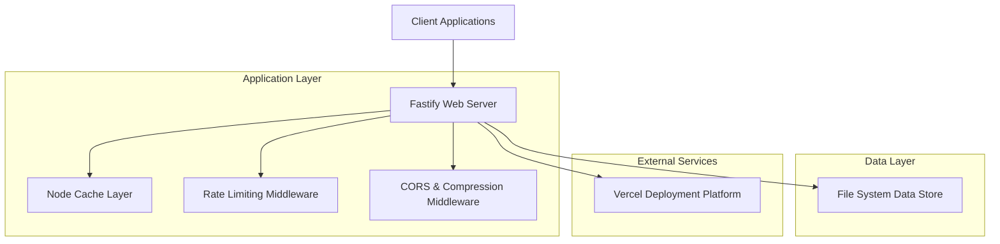
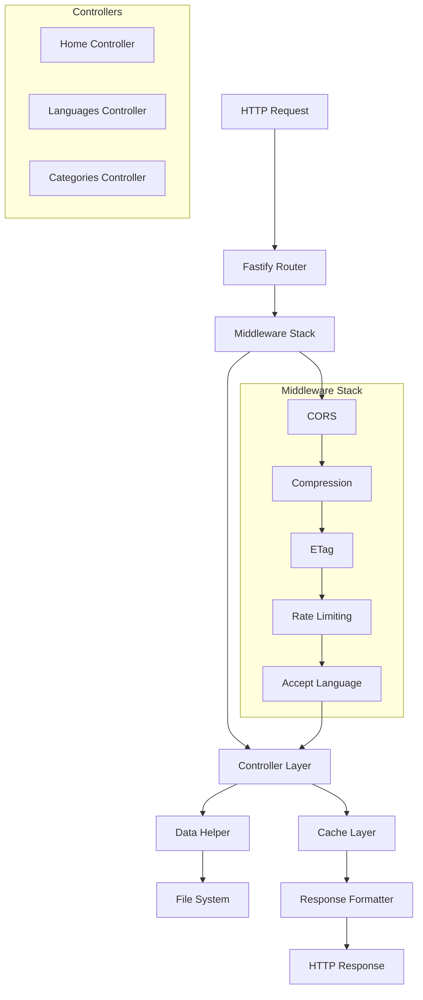
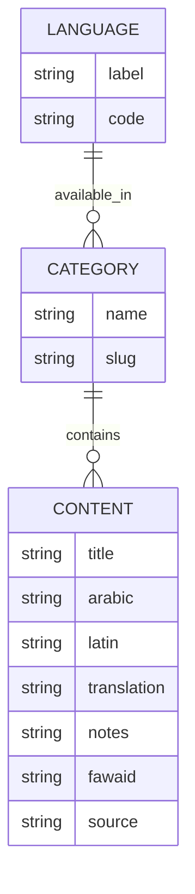

# Dua & Dhikr RESTful API - Technical Architecture Document

## 1. Architecture Design



## 2. Technology Description

- **Runtime**: Node.js@20+ with TypeScript@5.1.6
- **Web Framework**: Fastify@4.21.0 with plugins ecosystem
- **Caching**: node-cache@5.1.2 for in-memory caching (10s TTL)
- **Middleware**: @fastify/cors, @fastify/compress, @fastify/etag, @fastify/rate-limit, @fastify/accepts
- **Development**: ts-node, nodemon for development workflow
- **Deployment**: Vercel platform with serverless functions
- **Data Storage**: JSON files in file system (no external database)

## 3. Route Definitions

| Route | Purpose |
|-------|----------|
| GET / | Home endpoint - redirects to GitHub documentation |
| GET /languages | Returns available language options (Indonesian, English) |
| GET /categories | Returns categorized list of dua/dhikr content |
| GET /categories/:slug | Returns list of items within specified category |
| GET /categories/:slug/:id | Returns detailed content for specific dua/dhikr item |

## 4. API Definitions

### 4.1 Core API Endpoints

#### Language Information
```
GET /languages
```

Response:
| Field Name | Field Type | Description |
|------------|------------|-------------|
| statusCode | number | HTTP status code (200) |
| code | string | Response code ("OK") |
| data | LanguageType[] | Array of available languages |

Example Response:
```json
{
  "statusCode": 200,
  "code": "OK",
  "data": [
    {
      "label": "Bahasa Indonesia",
      "code": "id"
    },
    {
      "label": "English",
      "code": "en"
    }
  ]
}
```

#### Categories Listing
```
GET /categories
```

Headers:
| Header Name | Header Type | Required | Description |
|-------------|-------------|----------|-------------|
| Accept-Language | string | false | Language preference (defaults to 'id') |

Response:
| Field Name | Field Type | Description |
|------------|------------|-------------|
| statusCode | number | HTTP status code (200) |
| code | string | Response code ("OK") |
| data | CategoryType[] | Array of categories with total counts |

Example Response:
```json
{
  "statusCode": 200,
  "code": "OK",
  "data": [
    {
      "name": "Dzikir Pagi",
      "slug": "morning-dhikr",
      "total": 15
    }
  ]
}
```

#### Category Content Listing
```
GET /categories/:slug
```

Parameters:
| Param Name | Param Type | Required | Description |
|------------|------------|----------|-------------|
| slug | string | true | Category identifier (morning-dhikr, evening-dhikr, etc.) |

Headers:
| Header Name | Header Type | Required | Description |
|-------------|-------------|----------|-------------|
| Accept-Language | string | false | Language preference (defaults to 'id') |

Response:
| Field Name | Field Type | Description |
|------------|------------|-------------|
| statusCode | number | HTTP status code (200) |
| code | string | Response code ("OK") |
| data | ContentListItem[] | Array of content items with basic info |

#### Individual Content Detail
```
GET /categories/:slug/:id
```

Parameters:
| Param Name | Param Type | Required | Description |
|------------|------------|----------|-------------|
| slug | string | true | Category identifier |
| id | number | true | Content item ID (1-based indexing) |

Headers:
| Header Name | Header Type | Required | Description |
|-------------|-------------|----------|-------------|
| Accept-Language | string | false | Language preference (defaults to 'id') |

Response:
| Field Name | Field Type | Description |
|------------|------------|-------------|
| statusCode | number | HTTP status code (200) |
| code | string | Response code ("OK") |
| data | DetailType | Complete content object |

Example Response:
```json
{
  "statusCode": 200,
  "code": "OK",
  "data": {
    "id": 1,
    "title": "Ayat al-Kursi",
    "category": "morning-dhikr",
    "categoryName": "Dzikir Pagi",
    "arabic": "ٱللَّهُ لَآ إِلَٰهَ إِلَّا هُوَ...",
    "latin": "Allāhu lā ilāha illā huw...",
    "translation": "Allah, tidak ada Tuhan...",
    "notes": "Dibaca 1x",
    "fawaid": "Barang siapa yang membaca ayat ini...",
    "source": "HR. at-Tirmidzi: 2879"
  }
}
```

## 5. Server Architecture Diagram



## 6. Data Model

### 6.1 Data Model Definition



### 6.2 TypeScript Type Definitions

```typescript
// Core data types
export type LanguageType = {
  label: string
  code: string
}

export type CategoryType = {
  name: string
  slug: string
}

export type DetailType = {
  title: string
  arabic: string
  latin: string
  translation: string
  notes: string | null
  fawaid: string
  source: string
}

export type DataType = {
  languages: LanguageType[]
  categories: CategoryType[]
  items: Record<string, Record<string, DetailType[]>>
}
```

### 6.3 File System Data Structure

```
data/
├── core/
│   ├── languages.json          # Available languages configuration
│   └── categories.json         # Categories for each language
└── dua-dhikr/
    ├── morning-dhikr/
    │   ├── id.json            # Indonesian content
    │   └── en.json            # English content
    ├── evening-dhikr/
    │   ├── id.json
    │   └── en.json
    ├── daily-dua/
    │   ├── id.json
    │   └── en.json
    ├── selected-dua/
    │   ├── id.json
    │   └── en.json
    └── dhikr-after-salah/
        ├── id.json
        └── en.json
```

### 6.4 Configuration and Deployment

**Rate Limiting Configuration:**
- Maximum: 2 requests per second per IP
- Time window: 1 second
- Error response: 429 Too Many Requests

**Caching Strategy:**
- In-memory caching with node-cache
- TTL: 10 seconds for all cached data
- Cache key: Based on request parameters and language

**Error Handling:**
- 404 Not Found: Invalid endpoints or content not found
- 400 Bad Request: Invalid language or missing content
- 429 Too Many Requests: Rate limit exceeded
- 500 Internal Server Error: Unexpected server errors

**Deployment Configuration (Vercel):**
- Runtime: Node.js 20+
- Build command: `npm run build`
- Start command: `npm start`
- Environment: Production optimized with process signal handling